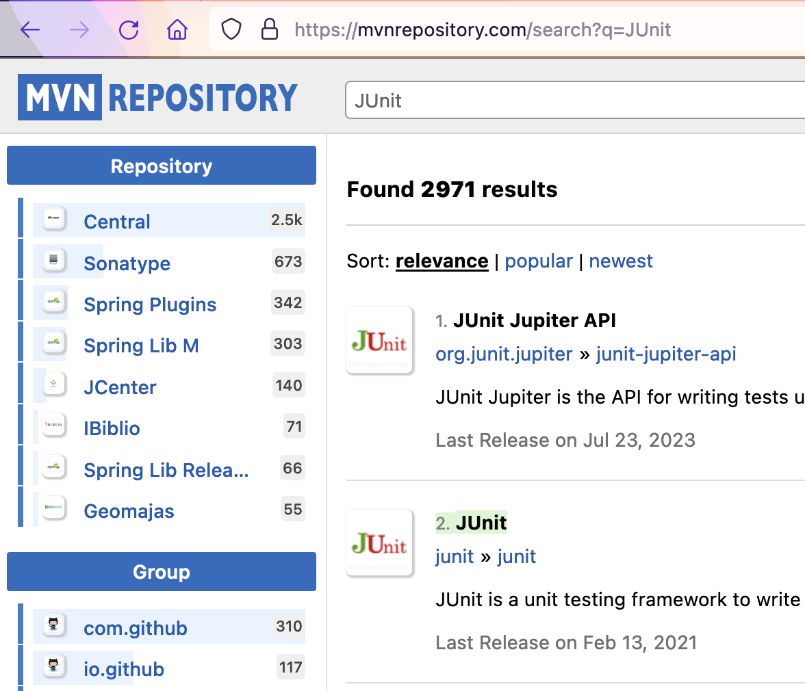

# Taller de TDD (Pruebas Unitarias)

Este taller adapta el enfoque clásico de **TDD** (Red → Green → Refactor) a una **Arquitectura Limpia (Clean Architecture)**. El objetivo es que las **pruebas unitarias** garanticen la calidad del **dominio** sin acoplarse a frameworks o infraestructura.

---

## 🎯 Objetivos del taller
- Diseñar pruebas unitarias que ejerciten **reglas de negocio** (dominio) de forma **aislada**.
- Aplicar TDD: **primero la prueba**, luego la implementación mínima, y **refactor** continuo.
- Mantener **dependencias hacia adentro**: el dominio **no** conoce bases de datos, HTTP ni librerías externas.

---

## PRUEBAS UNITARIAS BÁSICAS

---

### CREAR UN PROYECTO CON MAVEN

En el directorio de trabajo ejecutar el comando necesario para crear/generar un proyecto maven basado en un arquetipo:

```yml
Grupo (groupId): edu.unisabana.tyvs
Artefacto (artifactId): clasesequivalencia
Paquete (package): edu.unisabana.tyvs.tdd
archetypeArtifactId: maven-archetype-quickstart
```

🎓 Si necesitas más ayuda con la creación de proyectos en Maven, revisa el [**Taller de Nivelación**](https://github.com/CesarAVegaF312/tyvs-Taller_nivelacion.git).

---

### ACTUALIZAR Y CREAR DEPENDENCIAS EN EL PROYECTO

Busque en internet el repositorio central de ["maven"](https://mvnrepository.com/).

Busque el artefacto JUnit y entre a la versión más nueva.



**NOTA** Ingresar directamente a ["2. Junit"](https://mvnrepository.com/artifact/junit/junit).  

Ingrese a la pestaña de Maven y haga click en el texto de la dependencia para copiarlo al portapapeles.

Edite el archivo `pom.xml` y realice las siguientes actualizaciones:
- Agregue/Reemplace la dependencia copiada a la sección de dependencias.
- Cambie la versión del compilador de Java a la versión 8 (o el de su computador), agregando la sección `properties` antes de la sección de dependencias:

---

### Dependencias mínimas (`pom.xml`)

```xml
<properties>
  <maven.compiler.target>1.8</maven.compiler.target>
  <maven.compiler.source>1.8</maven.compiler.source>
</properties>

<dependencies>
  <!-- JUnit 5 -->
  <dependency>
    <groupId>org.junit.jupiter</groupId>
    <artifactId>junit-jupiter</artifactId>
    <version>5.10.2</version>
    <scope>test</scope>
  </dependency>

  <!-- Mockito para “dobles” de los puertos (ports) -->
  <dependency>
    <groupId>org.mockito</groupId>
    <artifactId>mockito-core</artifactId>
    <version>5.12.0</version>
    <scope>test</scope>
  </dependency>
</dependencies>

<build>
  <plugins>
    <plugin>
      <groupId>org.apache.maven.plugins</groupId>
      <artifactId>maven-surefire-plugin</artifactId>
      <version>3.2.5</version>
      <configuration><useModulePath>false</useModulePath></configuration>
    </plugin>
  </plugins>
</build>
```

---

### COMPILAR Y EJECUTAR
Ejecute los comandos de Maven, 
```bash
mvn clean compile
```
para compilar el proyecto y verificar que el proyecto se creó correctamente y los cambios realizados al archivo pom no generan inconvenientes.

Ejecute el comando para ejecutar las pruebas unitarias de un proyecto desde Maven y ejecútelo sobre el proyecto.

```bash
mvn clean test
```

 Se debe ejecutar la clase `AppTest` con resultado exitoso.

---

## EJERCICIO “REGISTRADURÍA”

Se va a crear un proyecto base siguiendo la estructura de **Arquitectura Limpia (Clean Architecture)** para un cliente en la registraduría, en el cual se registrarán personas con intención de votar para las próximas elecciones y se generarán los certificados electorales de aquellas personas cuyo voto sea válido.

Se usará la clase *Person* que se describe más adelante. El servicio de la registraduría permitirá registrar personas que sean votantes.

### REQUERIMIENTOS
- Solo se registrarán votantes válidos.
- Solo se permite una inscripción por número de documento.

---

### HACER EL ESQUELETO DE LA APLICACION

---

### Estructura propuesta (monomódulo por paquetes)

```
src/
 ├─ main/java/edu/unisabana/tyvs/
 │   ├─ domain/                 # Reglas de negocio puras
 │       ├─ model/              # Entidades / VOs (Person, Gender, RegisterResult)
 │       ├─ service/            # Casos de uso (Registry)
 └─ test/java/edu/unisabana/tyvs/
     └─ unit/                   # Pruebas unitarias puras del dominio (Mockito para ports)
```

> También puedes llevar esto a **multi-módulo Maven** más estricto más adelante. Para TDD, esta versión por paquetes es suficiente y simple.

---

#### Dominio: modelos

Cree el archivo `RegisterResult.java` en el directorio `edu.unisabana.tyvs.domain.model` con la enumeración:

```java
package edu.unisabana.tyvs.domain.model;
public enum RegisterResult { VALID, DUPLICATED, INVALID }
```

Cree el archivo `Gender.java` en el paquete `edu.unisabana.tyvs.domain.model` con la enumeración:

```java
package edu.unisabana.tyvs.domain.model;
public enum Gender { MALE, FEMALE, UNIDENTIFIED }
```

Cree el archivo `Person.java` en el paquete `edu.unisabana.tyvs.domain.model` con el siguiente contenido:

```java
package edu.unisabana.tyvs.domain.model;

public class Person {
    private final String name;
    private final int id;
    private final int age;
    private final Gender gender;
    private final boolean alive;

    public Person(String name, int id, int age, Gender gender, boolean alive) {
        this.name = name; this.id = id; this.age = age; this.gender = gender; this.alive = alive;
    }
    public String getName() { return name; }
    public int getId() { return id; }
    public int getAge() { return age; }
    public Gender getGender() { return gender; }
    public boolean isAlive() { return alive; }
}
```

---

#### Dominio: caso de uso (Servicio)

Cree el archivo `Registry.java` en el directorio `edu.unisabana.tyvs.domain.service` con el método `registerVoter`:

```java
package edu.unisabana.tyvs.domain.service;

import edu.unisabana.tyvs.domain.model.*;

public class Registry {

    public RegisterResult registerVoter(Person p) {
        // TODO Validate person and return real result.
        return RegisterResult.VALID;
    }
}
```

---

## TDD Paso a Paso (Red → Green → Refactor)

El ciclo TDD: Red → Green → Refactor es la práctica central de Desarrollo Guiado por Pruebas (Test-Driven Development) y consiste en tres pasos cortos y repetitivos:

### 1. RED (Rojo)

- Escribes una prueba unitaria nueva que describe el comportamiento que deseas.
- Como aún no has implementado el código (o la lógica está incompleta), la prueba falla.

### 2. GREEN (Verde)

- Escribes la implementación mínima para que la prueba pase.
- No importa si el código no es elegante todavía, lo importante es que sea funcional.

### 3. REFACTOR (Refactorizar)

- Una vez todas las pruebas están en verde, mejoras el código:
  - Limpias duplicación.
  - Renombras variables o métodos.
  - Ordenas condiciones.
  - Extraes constantes.
- Lo clave: no rompes pruebas existentes.

Todos los archivos relacionados específicamente con los temas de pruebas deben ir bajo la carpeta `test`.

Adicional a esta practica de creacion de pruebas vamos a seguir el diseño de pruebas patrón **AAA (Arrange – Act – Assert)**:

## Patrón AAA (Arrange – Act – Assert)

En el diseño de pruebas unitarias se recomienda estructurar cada método de prueba siguiendo el patrón AAA:

### Arrange (Preparar)
- Se configuran los datos, objetos y estado inicial necesarios para la prueba.

### Act (Actuar)
- Se ejecuta la acción que queremos probar.

### Assert (Afirmar)
- Se verifican los resultados obtenidos frente a lo esperado.

## ⚠️ Nota importante

✅ Este patrón mejora la legibilidad y mantenibilidad de las pruebas porque:

- Hace evidente qué se está preparando, qué se está probando y qué se está validando.
- Facilita que otros desarrolladores entiendan rápidamente el propósito de cada prueba.
- Evita que las pruebas se conviertan en “cajas negras” difíciles de interpretar.

Empecemos ...

---

## EJECUTAR LAS PRUEBAS

---

### 1. RED: primera prueba (camino feliz)

Bajo la carpeta de pruebas, cree la clase `RegistryTest.java` en el directorio `edu.unisabana.tyvs.unit`:

```java
package edu.unisabana.tyvs.unit;

import edu.unisabana.tyvs.domain.model.*;
import edu.unisabana.tyvs.domain.service.Registry;
import org.junit.Assert;
import org.junit.Test;

public class RegistryTest {

    @Test
    public void shouldRegisterValidPerson() {
        // Arrange: preparar los datos y el objeto a probar
        Registry registry = new Registry();
        Person person = new Person("Ana", 1, 30, Gender.FEMALE, true);

        // Act: ejecutar la acción que queremos probar
        RegisterResult result = registry.registerVoter(person);

        // Assert: verificar el resultado esperado
        Assert.assertEquals(RegisterResult.VALID, result);
    }
}

```

### 2. GREEN: implementación mínima
Ya devuelve `VALID`, la prueba pasa.

---

## ⚠️ Nota importante sobre ubicación del `pom.xml`

Recuerde ejecutar todos los comandos Maven desde la carpeta **raíz del proyecto**, donde se encuentra el archivo `pom.xml`.

---

Para correr las pruebas utilice:
```sh
$ mvn package
```

También puede utilizar:
```sh
$ mvn test
```

---

Revise cuál es la diferencia.  
Tip: [Maven Lifecycle Phases](https://www.devopsschool.com/blog/maven-tutorials-maven-lifecycle-phases-goal).

---

Pero hagamos otra prueba ...

---

### 1. RED: persona muerta → DEAD

```java

    @Test
    public void shouldRejectDeadPerson() {
        // Arrange: preparar los datos y el objeto a probar
        Registry registry = new Registry();
        Person dead = new Person("Carlos", 2, 40, Gender.MALE, false);

        // Act: ejecutar la acción que queremos probar
        RegisterResult result = registry.registerVoter(dead);

        // Assert: verificar el resultado esperado
        Assert.assertEquals(RegisterResult.DEAD, result);
    }

```

### 2. GREEN: implementación mínima
Agregue este código a su clase `Registry.java` para ir complementando y haciendo mas robusta su clase.

```java

if (!p.isAlive()) return RegisterResult.DEAD;

```

### 3. Refactor
Refactorizando el código.

```java
package edu.unisabana.tyvs.tdd.registry;

public class Registry {

    public RegisterResult registerVoter(Person p) {
        if (p == null) {
            return RegisterResult.INVALID; // regla defensiva
        }
        if (!p.isAlive()) {
            return RegisterResult.DEAD;
        }
        // implementación mínima para pasar las pruebas actuales
        return RegisterResult.VALID;
    }
}
```

Ejecutar y validar nuevamente el resultado.

---

## CLASES DE EQUIVALENCIA

Piense en los casos de [equivalencia](https://prezi.com/view/LyUYlz5nx2UmnKVMgSve/?referral_token=inUc7klnB3FN) que se pueden generar del ejercicio para la registraduría dadas las condiciones.

Complete la implementación de la clase `RegistryTest.java` con (al menos) un método por cada clase de equivalencia, creando diferentes personas y validando que el resultado sea el esperado.

Complete la implementación del método `registerVoter` en la clase `Registry.java` para retornar el resultado esperado según la entrada.

---

# Guía avanzada de Pruebas Unitarias

Las pruebas unitarias son la base de un plan de pruebas exhaustivo. Para alinearnos con las buenas prácticas internacionales y los resultados de aprendizaje del curso, además de implementar las pruebas básicas, se deben considerar los siguientes aspectos:

---

## 1. Planificación de las pruebas
Define una **matriz de clases de equivalencia y valores límite** para `registerVoter`. Ejemplo:

| Caso | Entrada | Resultado esperado |
|------|---------|---------------------|
| Persona viva, edad 30, id único | (edad=30, vivo=true, id=1) | VALID |
| Persona muerta | (edad=45, vivo=false) | DEAD |
| Edad 17 | (edad=17, vivo=true) | UNDERAGE |
| Edad -1 | (edad=-1, vivo=true) | INVALID_AGE |
| Persona duplicada | (edad=25, id=777 dos veces) | DUPLICATED |

---

## 2. Cobertura de código

Agrega **JaCoCo** para medir cobertura.  
Este plugin debe incluirse dentro de la sección `<build><plugins> ... </plugins></build>` del archivo `pom.xml`.

```xml
    <!-- (Opcional pero recomendado) JaCoCo para cobertura -->
    <plugin>
      <groupId>org.jacoco</groupId>
      <artifactId>jacoco-maven-plugin</artifactId>
      <version>0.8.12</version>
      <executions>
        <execution>
          <id>prepare-agent</id>
          <goals><goal>prepare-agent</goal></goals>
        </execution>
        <execution>
          <id>report</id>
          <phase>verify</phase>
          <goals><goal>report</goal></goals>
        </execution>
      </executions>
    </plugin>
```

Ejecuta:

```sh
mvn clean test
mvn jacoco:report
```

Revisa el archivo `target/site/jacoco/index.html`.

---

## 3. Robustez de las pruebas
Incluye casos adicionales:
- Persona nula (`null`) `shouldReturnInvalidWhenPersonIsNull()`
- `id <= 0`.
- Valores de borde (`17`, `18`, `120`, `121`).
- `shouldReturnInvalidWhenUnderAge()` (edad < 18)  
- `shouldReturnValidWhenNewAdultAlive()`

> **Regla**: todas las pruebas unitarias se enfocan en **dominio**.

---

## 4. Gestión de defectos
Crea un archivo `defectos.md` para documentar fallos:

```
### Defecto 01
- Caso: edad -1
- Esperado: INVALID_AGE
- Obtenido: VALID
- Causa probable: falta de validación en límites
- Estado: Abierto
```

---

## 5. Automatización e integración (Opcional)
- Ejecuta las pruebas unitarias en cada commit con CI (GitHub Actions, Jenkins, GitLab CI).  
- Rechaza merges si `mvn test` falla.

---

## PARA ENTREGAR

- Repositorio Git con el proyecto y la URL de entrega.
- Archivo `.gitignore` (excluir `target`, archivos del IDE, etc.).
- Integrantes (archivo integrantes.txt o sección en el README).
- README con:
  - Instrucciones para compilar y correr pruebas (mvn clean test).
  - Descripción breve del dominio y reglas validadas.
  - Breve explicación de **TDD (Red → Green → Refactor)** y **AAA** aplicada en el proyecto.
- Pruebas unitarias:
  - ≥ 5 clases de equivalencia + valores límite (17/18, 120/121…).
  - Todas las pruebas escritas con **AAA (Arrange–Act–Assert)**.
- Nomenclatura clara de métodos (`should…`), y un solo assert principal por test (o varios con misma intención).
- Cobertura:
  - Reporte **JaCoCo** adjunto (carpeta `target/site/jacoco/` o captura).
  - ≥ 80% de cobertura global y ≥ 80% en el paquete …tdd.registry (si aplica).
- Evidencia de TDD:
  - Breve sección **“Historia TDD”** en el README indicando al menos 3 iteraciones: prueba nueva (Rojo) → cambio mínimo (Verde) → refactor (mantener Verde).
  - Opcional: capturas o mensajes de commit que reflejen el ciclo (e.g., `test: add dead person rule (RED)`, `feat: minimal check alive (GREEN)`, `refactor: extract constants (REFACTOR)`).
- Matriz de pruebas:
  - Tabla con **clases de equivalencia** y **valores límite**: entradas, resultado esperado y test que lo cubre (nombre del método).
- Gestión de defectos:
  - Archivo `defectos.md` con al menos **1 defecto** real encontrado o simulado: caso, esperado vs. obtenido, causa probable, estado (Abierto/Cerrado).
- Calidad del código:
  - Constantes extraídas (p. ej., `MIN_AGE`, `MAX_AGE`).
  - Sin **“código muerto”**, sin duplicación evidente en pruebas o producción.
  - Comentarios mínimos y expresivos; preferir nombres autoexplicativos.
- Ejecución reproducible:
  - Proyecto Maven ejecutable con `mvn clean test` sin pasos manuales adicionales.

- Reflexiona sobre:
  - ¿Qué escenarios no se cubrieron?
  - ¿Qué defectos reales detectaron los tests?
  - ¿Cómo mejorarías la clase `Registry` para facilitar su prueba?

---

# Recursos recomendados
- *The Art of Software Testing* – Myers, 2011.  
- *Testing Computer Software* – Kaner, 1999.  
- *Effective Unit Testing* – Lasse Koskela, 2013.  

---

## ⚠️ Nota importante: Con estas prácticas, tus pruebas unitarias no solo validan la funcionalidad, sino que se convierten en un **instrumento de calidad**, cumpliendo con los indicadores de desempeño del curso.
